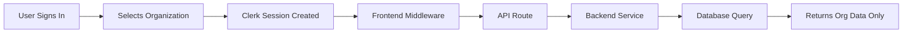

# Multi-Tenant Architecture

Understanding how the QGPS Control Plane implements secure multi-tenancy using Clerk organizations.

## Overview

The QGPS Control Plane is designed as a multi-tenant SaaS platform where:
- Each **organization** is a separate tenant
- Users can belong to multiple organizations
- Data is completely isolated between organizations
- All resources (projects, executions, API keys) are scoped to organizations

## Architecture Layers

### 1. Frontend (Next.js)

**Clerk Authentication**
- Users authenticate via Clerk
- Organization context provided by Clerk SDK
- Automatic organization switching support

**Middleware Protection**
- `src/middleware.ts` enforces authentication
- Redirects users without organization to selection page
- Injects organization context headers for API routes

```typescript
// Middleware automatically injects headers:
X-Organization-ID: org_abc123
X-User-ID: user_xyz789
X-Clerk-Org-Role: org:admin
```

### 2. API Layer (Next.js API Routes)

**Context Extraction**
- API routes use `requireOrg()` helper
- Automatically gets organization from authenticated session
- Validates user has access to organization

**Permission Enforcement**
- Role-based access control (RBAC)
- `requireRole(['org:admin'])` for admin-only endpoints
- Scope-based permissions for API keys

### 3. Backend (Your API Service)

**Header Reading**
- Backend reads `X-Organization-ID` from requests
- No additional authentication needed (trust proxy)
- Use org ID for all database queries

**Database Isolation**
- Add `org_id` column to all tables
- Always filter queries by `org_id`
- Use database row-level security (RLS) for extra protection

## Organization Roles

### org:admin
- Full access to organization settings
- Can manage members and roles
- Can create/delete projects
- Can create API keys for organization
- Can view billing and usage

### org:member  
- Can create and manage own projects
- Can run executions
- Can create user-scoped API keys
- Cannot manage organization members
- Cannot access billing

### org:viewer
- Read-only access to organization resources
- Can view projects and executions
- Cannot create or modify resources
- Cannot create API keys

## Organization Context Flow



### Step-by-Step Flow

1. **User Authentication**
   ```typescript
   // User signs in via Clerk
   const { userId, orgId, orgRole } = await auth();
   ```

2. **Frontend Middleware**
   ```typescript
   // src/middleware.ts
   // Injects headers for API routes
   requestHeaders.set('X-Organization-ID', orgId);
   requestHeaders.set('X-User-ID', userId);
   requestHeaders.set('X-Clerk-Org-Role', orgRole);
   ```

3. **API Route Handler**
   ```typescript
   // src/app/api/projects/route.ts
   const context = await requireOrg(); // { userId, orgId, orgRole }
   const projects = await fetchProjects(context.orgId);
   ```

4. **Backend Service**
   ```go
   // Backend reads header
   orgID := r.Header.Get("X-Organization-ID")
   
   // Query with org filter
   projects := db.Query("SELECT * FROM projects WHERE org_id = ?", orgID)
   ```

## Database Schema Requirements

All tables should include `org_id` for tenant isolation:

```sql
-- Projects table
CREATE TABLE projects (
  id UUID PRIMARY KEY,
  org_id VARCHAR(255) NOT NULL,  -- Clerk organization ID
  name VARCHAR(255) NOT NULL,
  description TEXT,
  status VARCHAR(50),
  created_by VARCHAR(255) NOT NULL,  -- Clerk user ID
  created_at TIMESTAMP DEFAULT CURRENT_TIMESTAMP,
  updated_at TIMESTAMP DEFAULT CURRENT_TIMESTAMP,
  
  -- Indexes for performance
  INDEX idx_projects_org_id (org_id),
  INDEX idx_projects_created_by (created_by)
);

-- Executions table
CREATE TABLE executions (
  id UUID PRIMARY KEY,
  org_id VARCHAR(255) NOT NULL,
  project_id UUID NOT NULL,
  status VARCHAR(50),
  started_at TIMESTAMP,
  completed_at TIMESTAMP,
  created_by VARCHAR(255) NOT NULL,
  created_at TIMESTAMP DEFAULT CURRENT_TIMESTAMP,
  
  INDEX idx_executions_org_id (org_id),
  INDEX idx_executions_project_id (project_id)
);

-- Organization quotas
CREATE TABLE organization_quotas (
  org_id VARCHAR(255) PRIMARY KEY,
  executions_used INT DEFAULT 0,
  executions_limit INT DEFAULT 1000,
  storage_used_bytes BIGINT DEFAULT 0,
  storage_limit_bytes BIGINT DEFAULT 10737418240,  -- 10 GB
  updated_at TIMESTAMP DEFAULT CURRENT_TIMESTAMP
);
```

## Row-Level Security (RLS)

For PostgreSQL, add RLS policies:

```sql
-- Enable RLS on projects table
ALTER TABLE projects ENABLE ROW LEVEL SECURITY;

-- Create policy for tenant isolation
CREATE POLICY tenant_isolation_policy ON projects
  USING (org_id = current_setting('app.current_org_id')::VARCHAR);

-- Set org_id before queries
SET app.current_org_id = 'org_abc123';

-- Now queries automatically filter by org_id
SELECT * FROM projects;  -- Only returns projects for org_abc123
```

## Organization Switching

Users can switch between organizations without signing out:

```typescript
// Frontend: OrganizationSwitcher component handles this
<OrganizationSwitcher
  afterSelectOrganizationUrl="/dashboard"
/>

// Backend: New requests automatically use new org context
const { orgId } = await auth();  // Returns new org after switch
```

## Data Isolation Checklist

✅ **DO:**
- Always include `org_id` in database queries
- Validate `org_id` matches authenticated organization
- Use prepared statements to prevent SQL injection
- Add database indexes on `org_id` columns
- Implement RLS policies for defense-in-depth
- Test with multiple organizations to verify isolation

❌ **DON'T:**
- Trust client-provided `org_id` - always use server session
- Allow cross-organization data access
- Use user ID alone for queries (always use org_id too)
- Skip validation of organization membership
- Share API keys across organizations

## Testing Multi-Tenancy

### Create Test Organizations

1. Sign up with first email → Create "Test Org A"
2. Sign up with second email → Create "Test Org B"  
3. Invite first user to "Test Org B"

### Verify Isolation

1. **Create resources in Org A**
   - Create Project "Project A"
   - Note the project ID

2. **Switch to Org B**
   - Use OrganizationSwitcher
   - Verify "Project A" is not visible

3. **Attempt unauthorized access**
   ```bash
   # Try to access Org A project while in Org B
   curl -X GET https://api.example.com/v1/projects/PROJECT_A_ID \
     -H "Authorization: Bearer ORG_B_API_KEY"
   # Should return 404 or 403
   ```

4. **Verify API routes**
   - Check X-Organization-ID header changes with org switch
   - Verify all API responses only include current org data

## Common Pitfalls

### 1. Forgetting org_id in Queries

❌ **Wrong:**
```typescript
// Queries all projects across all organizations!
const projects = await db.query('SELECT * FROM projects WHERE created_by = ?', userId);
```

✅ **Correct:**
```typescript
// Properly scoped to organization
const projects = await db.query(
  'SELECT * FROM projects WHERE org_id = ? AND created_by = ?',
  [orgId, userId]
);
```

### 2. Trusting Client Headers

❌ **Wrong:**
```typescript
// Client could send fake org_id header
const orgId = request.headers.get('X-Organization-ID');
const projects = await fetchProjects(orgId);
```

✅ **Correct:**
```typescript
// Always get org from authenticated session
const { orgId } = await requireOrg();
const projects = await fetchProjects(orgId);
```

### 3. Not Validating Organization Access

❌ **Wrong:**
```typescript
// Doesn't check if user belongs to organization
const project = await db.query('SELECT * FROM projects WHERE id = ?', projectId);
```

✅ **Correct:**
```typescript
// Verifies both project exists AND user has access
const project = await db.query(
  'SELECT * FROM projects WHERE id = ? AND org_id = ?',
  [projectId, orgId]
);
```

## Monitoring & Auditing

### Audit Logging

Log all organization-scoped actions:

```typescript
// Example audit log entry
{
  "action": "project.created",
  "userId": "user_xyz789",
  "orgId": "org_abc123",
  "resourceId": "proj_123",
  "timestamp": "2024-01-01T12:00:00Z",
  "ipAddress": "192.168.1.1",
  "userAgent": "Mozilla/5.0..."
}
```

### Metrics to Monitor

- API requests per organization
- Resource usage per organization  
- Failed authorization attempts
- Cross-org access attempts (security alert!)
- Organization switching frequency

## Scaling Considerations

### Database Sharding

For large deployments, consider sharding by organization:

```
Shard 1: org_abc123, org_def456
Shard 2: org_ghi789, org_jkl012
```

### Caching Strategy

Cache organization data with org_id as key:

```typescript
const cacheKey = `org:${orgId}:projects`;
const cached = await redis.get(cacheKey);
```

### Rate Limiting

Apply rate limits per organization:

```typescript
const rateLimitKey = `ratelimit:${orgId}`;
const requestCount = await redis.incr(rateLimitKey);
if (requestCount > LIMIT) {
  throw new RateLimitError();
}
```

## Additional Resources

- [Clerk Organizations Documentation](https://clerk.com/docs/organizations)
- [BACKEND_INTEGRATION.md](./BACKEND_INTEGRATION.md) - Backend implementation guide
- [API_KEYS.md](./API_KEYS.md) - API key management
- [OWASP Multi-Tenancy Security](https://owasp.org/www-project-multitenant-architecture/)
